Polygon visualiser in Desmos
==============================

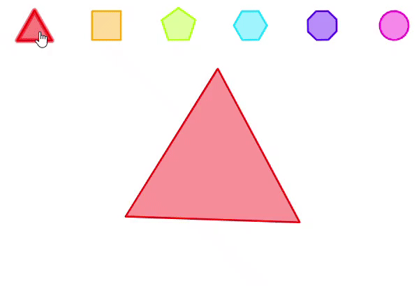  
[Project in Desmos](https://www.desmos.com/calculator/tjtgquofii "show all code")

Introduction
------------

Here I show you how recreate this visualisation in Desmos.
	
### Draw regular polygon using polar equation

First we find equation of straight line in polar equation  
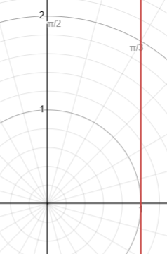  
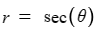  

Next we slice this line in respect to range of angle. This range depends on number of sides from regular polygon.  
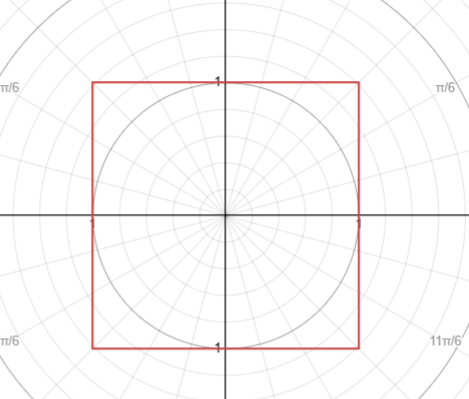  
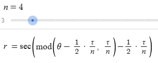  
	
	Here we see that we slice that line in this way:  
	from angle:		-1/2 * τ/n  
	to angle:        1/2 * τ/n
		
Next we change base of this polygon to down by rotating it by 270⁰.  
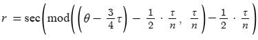  
	
### Transition between polygons

First we define linear animation function:  
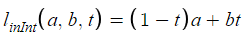

And use it to see how look transition from triangle to square:
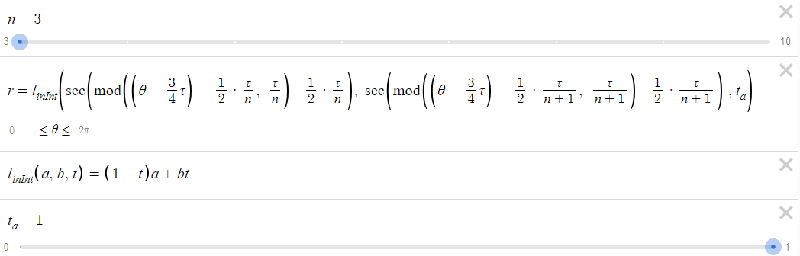  
   
	
### Adding animation of rotation

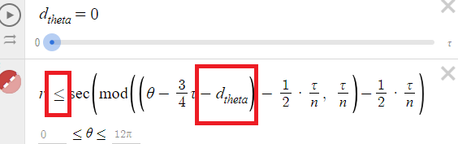  
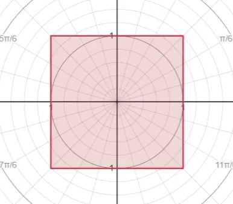
	
### Adding buttons

Using polar equation here would be very hard here, because origin is no longer at (0, 0).  
So we can transform this equation to parametric equation:  
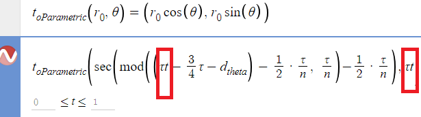

For theta you substitute `τt`.
Some small changes and add translation vectors:  
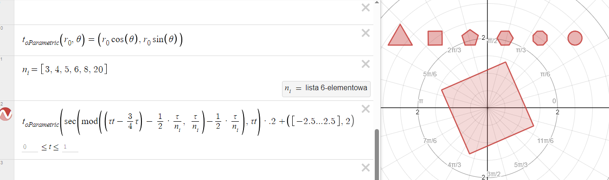
	
### Setting colors for buttons

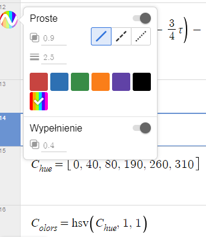
	
### Add actions to buttons which transform big polygon

First when we click some button let's set variable describing current number of sides for our polygon.  
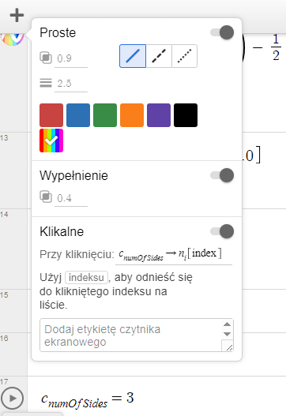
	
To transition we need store previous number of sides.
So for click in button we also change this previous variable.
Also we will reset `t_a` slider.  
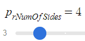  
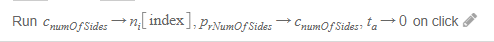  
	
and substitute this variables to polar function:  
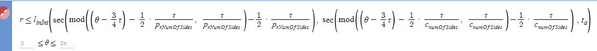
	
### Go to next polygon when big polygon clicked

Desmos detects only sides (not field inside) in polar equation. So again we need transform this big polygon into parametric equation.
	
So let's replace inequality with this:  
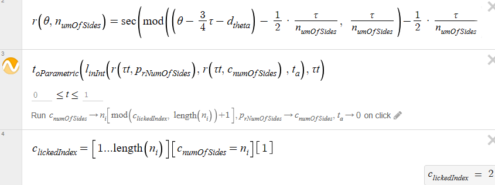	
	
In `c_lickedIndex` we used a fact that `c_NumOfSides` always have value included in `ni` list. So we get list of elements (as indexes) in which this condition is true (only one) and get it (`[...][...][1]`).
	
So we have function `r()`. So let's do prettier list of buttons:  
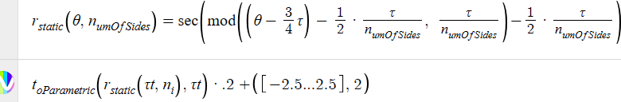	
	
### Smooth color transition

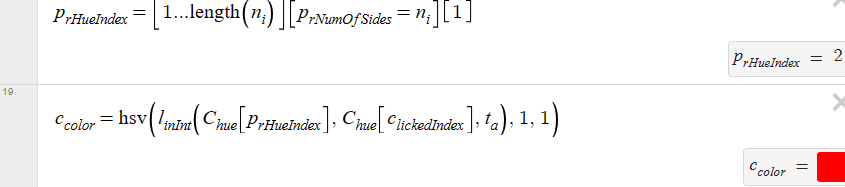  
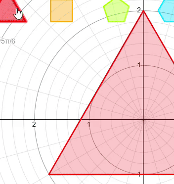  

Smaller things:
---------------
	
### Colors are flashing when transition from circle to triangle

  
	
To fix this, use modified linear interpolation:  
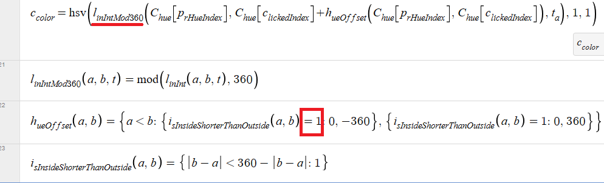
	
In 22 line we make in in cleaner way (verbal term). In Desmos you must remember about additional comparision.  
End of 23 line looks some strange (`...:1`). It is still if statement, only without else (returns undefined). 

### Too big triangle

Let's add this to scale down triangle:  
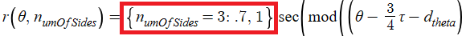  
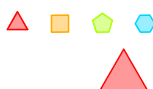  

And translate triangle button in down  
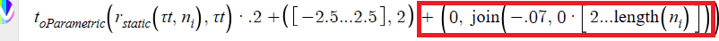	

It's very funny that you multiply list by 0, to create list filled by zeros.
	
Conclusion:
-----------

It takes only 18 lines. This article contained many useful tricks and issues in Desmos: actions (clickable), piecewise expression ( `{ } if else`), polar equations, parametric equations, colors, linear interpolation, create list with evenly spaced elements, list with condition, filling list, offsets, etc.
	
### Ideas for apply in web:

- polygon shaped buttons instead buttons with numbers (3, 4, 5, 6, 8, ∞)
- custom svg as polygons
	

